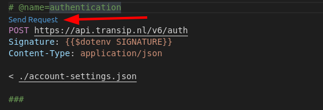
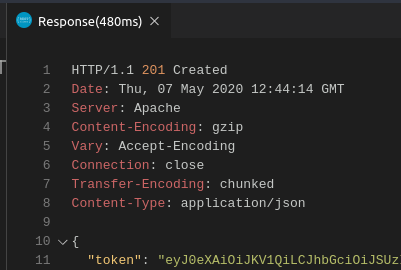

# TRANSIP API WITH VSCODE

## Prerequisites

- VS Code
- VS Code extension ["humao.rest-client"](https://marketplace.visualstudio.com/items?itemName=humao.rest-client)
- Linux tools openssl + jq (for json editing)

## Getting started

1. Open the ```rest.http``` file in VS Code. Syntax highlighting will be enabled it the rest-client is correctly installed. 
2. Make sure you create a account-settings.json file based on the sample provided. 
3. Execute the auth.sh shell script. This will create an .env file with the correct signature. 
4. Execute the ```authenticate``` rest request to get an access token.



If everything works there will be a result looking something like this:



Now you are ready to execute Api calls!

## Using the token in an API Request

The received token can be used as a bearer token for all requests. Just take a close look at the rest.http file:

```
# @name authentication < This names the request
POST https://api.transip.nl/v6/auth
Signature: {{$dotenv SIGNATURE}}
Content-Type: application/json

< ./account-settings.json

###

# @name invoices

GET https://api.transip.nl/v6/invoices
Content-Type: application/json
Authorization: Bearer {{authentication.response.body.token}} < So we can reuse the request here

###
```

The token can be reused for multiple requests, there is no need te re-request a token as long as the token is valid.

## Using a previous request to get detailed information

It is also possible to use a previous request to use values of the response in a new request. 

In the rest file I can execute the listAllDomains and use the result to request the details of the first domain name:

```
###

# @name contacts

GET https://api.transip.nl/v6/domains/{{listAllDomains.response.body.domains[0].name}}/contacts
Content-Type: application/json
Authorization: Bearer {{authentication.response.body.token}}

###
```
